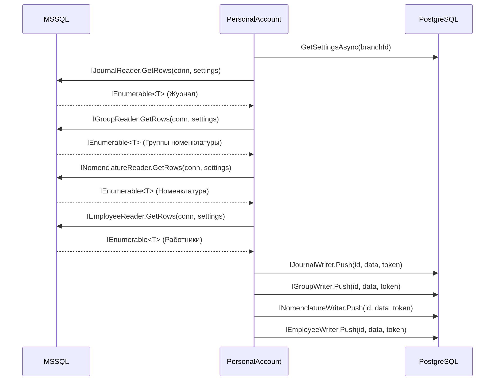

Алгоритм делится на следующие шаги:
1. Сверка позиции (GetSettingsAsync) - грузим настройки и по ним находим необхолимый набор данных

2. Получаем информацию о журнале, из нее находим новых сотрудников, номенклатуру и категории

3. Запрашиваем информацию о новых данных

4. Записываем в БД все полученные данные

Диаграмма

